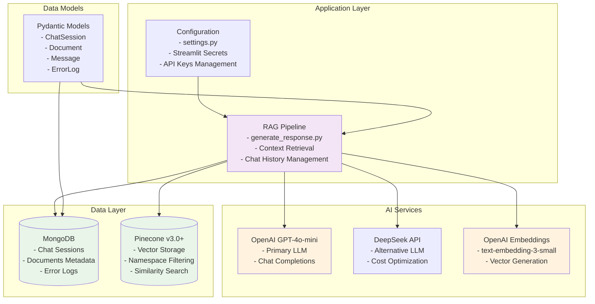
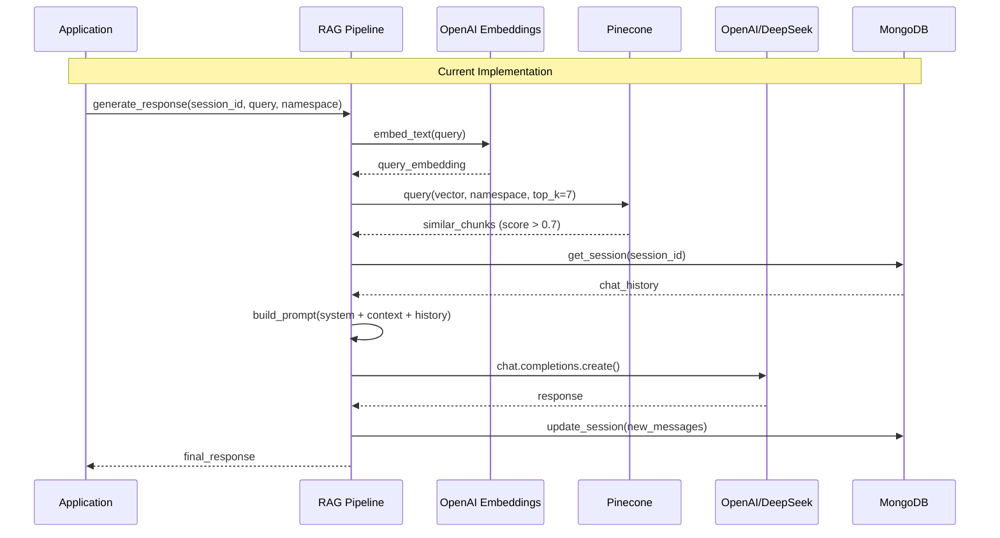
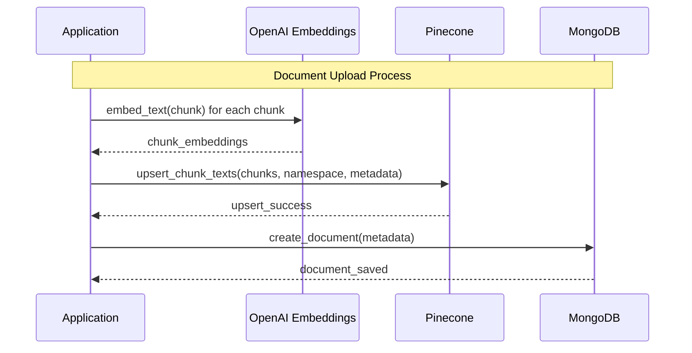

# Chatbot THCS Nhân Chính - Technical Specification (Based on Actual Implementation)

## 📋 Executive Summary

**Project**: Intelligent Q&A Chatbot System for THCS Nhân Chính  
**Version**: 0.0.1 (Early Development)  
**Purpose**: AI-powered RAG chatbot providing automated responses for school-related queries  
**Target Users**: Students, Teachers, Administrators  
**Current Status**: Core RAG pipeline implemented, UI development in progress

### Key Value Propositions
- **Flexible LLM**: Supports both OpenAI GPT-4o-mini and DeepSeek API
- **Topic-Aware**: Namespace-based content filtering in Pinecone
- **Simple Architecture**: Direct Python integration without complex frameworks
- **Cost-Effective**: OpenAI Ada-002 embeddings with efficient vector storage

---

## 🏗️ System Architecture (As Implemented)

### Architecture Overview



### Technology Stack (Actual Implementation)

| Component | Technology | Version | Purpose |
|-----------|------------|---------|---------|
| **Language** | Python | 3.11+ | Core runtime |
| **LLM Primary** | OpenAI GPT-4o-mini | Latest | Text generation |
| **LLM Secondary** | DeepSeek API | Latest | Cost-effective alternative |
| **Embeddings** | OpenAI text-embedding-3-small | Latest | Text vectorization |
| **Vector DB** | Pinecone | 3.0+ | Similarity search |
| **Database** | MongoDB | 4.6+ | Metadata & sessions |
| **Data Models** | Pydantic | 2.5+ | Type validation |
| **Configuration** | Streamlit Secrets | Latest | Environment management |

---

## 🔄 System Workflows (Implemented)

### Chat Query Processing Flow



### Document Processing Flow (Partially Implemented)



---

## 🗃️ Data Architecture (Actual Schema)

### Pinecone Vector Storage

```python
# Vector Structure
{
    "id": "document-name-0-uuid",
    "values": [1536_dimensional_vector],
    "metadata": {
        "chunk_text": "actual_content",
        "document_id": "unique_doc_id", 
        "document_name": "filename.pdf",
        "chunk_index": 0
    },
    "namespace": "thong_tin_truong"  # Topic-based filtering
}
```

### MongoDB Collections (Implemented)

#### ChatSession Collection
```python
{
    "_id": ObjectId,
    "session_id": "unique_session_id",
    "topic": "thong_tin_truong", 
    "start_time": datetime,
    "messages": [
        {
            "role": "user|assistant",
            "content": "message_content"
        }
    ]
}
```

#### Document Collection
```python
{
    "_id": ObjectId,
    "document_id": "unique_doc_id",
    "name": "filename.pdf",
    "topic": "thong_tin_truong",
    "file_type": ".pdf",
    "file_size": 1024000,
    "status": "uploaded",
    "chunk_count": 25
}
```

#### ErrorLog Collection
```python
{
    "_id": ObjectId,
    "error_id": "unique_error_id",
    "message": "error_description",
    "level": "error|warning|info",
    "component": "embedding_service|rag_pipeline",
    "topic": "thong_tin_truong"
}
```

---

## 🎯 Core Features (Currently Implemented)

### 1. RAG Pipeline (`src/rag/generate_response.py`)

```python
def generate_response(session_id: str, query: str, namespace: str) -> str:
    """
    Core RAG implementation:
    1. Get context from Pinecone using query embedding
    2. Retrieve chat history from MongoDB
    3. Build prompt with system + context + history  
    4. Generate response using OpenAI/DeepSeek
    5. Update session with new messages
    """
```

**Key Features:**
- Context retrieval with similarity threshold (0.7)
- Chat history management (last 10 messages)
- Fallback response for no relevant context
- Session persistence in MongoDB

### 2. Vector Operations (`src/database/pinecone_client.py`)

```python
# Core Functions Implemented:
- embed_text(text) -> List[float]
- upsert_chunk_texts(chunks, namespace, metadata)
- get_context_by_query(query, namespace, top_k)
- delete_document_chunks(document_id, namespace)
```

**Features:**
- Namespace-based topic filtering
- Batch vector upserts (100 vectors/batch)
- Automatic similarity filtering
- Document cleanup functionality

### 3. Configuration Management (`src/configs/settings.py`)

```python
@dataclass
class AppConfig:
    APP_NAME: str = "Chatbot THCS Nhân Chính"
    MAX_UPLOAD_SIZE_MB: int = 10
    SUPPORTED_TOPICS: Dict = {"thong_tin_truong": {...}}

@dataclass
class PineconeConfig:
    class NAME_SPACE(Enum):
        THONG_TIN_TRUONG = "thong_tin_truong"
        THONG_TIN_LOP = "thong_tin_lop"
        # ... other namespaces
```

**Configuration Classes:**
- `AppConfig`: Application settings
- `DeepSeekConfig`: DeepSeek API configuration  
- `OpenAIConfig`: OpenAI API configuration
- `PineconeConfig`: Vector database settings
- `MongoDBConfig`: Database configuration
- `RAGConfig`: RAG parameters

### 4. Data Models (`src/models/`)

```python
# Pydantic Models
class Message(BaseModel):
    role: str  # "user" | "assistant"
    content: str

class ChatSession(BaseModel):
    session_id: str
    topic: str
    start_time: datetime
    messages: List[Message]

class Document(BaseModel):
    document_id: str
    name: str
    topic: str
    file_type: str
    file_size: int
    chunk_count: int
```

### 5. Prompt Management (`src/prompts/`)

```
src/prompts/
├── SYSTEM_PROMPT.txt      # Main system instructions
├── THONG_TIN_TRUONG.txt   # School information context
├── PHAN_HOI_KHI_LOI.txt   # Error fallback response
└── PROMPTS.py             # Prompt loader utilities
```

**Prompt Strategy:**
- File-based prompt management
- UTF-8 Vietnamese language support
- Dynamic prompt loading
- Error handling responses

---

## 💻 Implementation Details

### Environment Configuration

```bash
# Required in Streamlit Secrets or .env
DEEPSEEK_API_KEY=sk-your-deepseek-key
OPENAI_API_KEY=sk-your-openai-key  
PINECONE_API_KEY=your-pinecone-key
MONGODB_CONNECTION_STRING=mongodb+srv://...

# Pinecone Settings
PINECONE_INDEX_NAME=thpt-nhan-chinh-kb
PINECONE_DIMENSION=1536
PINECONE_TOP_K=7

# OpenAI Settings
OPENAI_EMBEDDING_MODEL=text-embedding-3-small
OPENAI_LLM_MODEL=gpt-4o-mini

# RAG Settings
RAG_CHUNK_SIZE=1024
RAG_CHUNK_OVERLAP=128
RAG_SIMILARITY_TOP_K=7
```

### Project Structure (Actual)

```
CHATBOT_THCS_NHAN_CHINH/
├── requirements.txt           # Dependencies 
├── README.md                  # Documentation
├── overview.md               # This file
├── IMPORT_STANDARDS.md       # Import conventions
├── note.md                   # Development notes
│
src/                          # Source code
├── __init__.py
├── configs/
│   ├── __init__.py
│   └── settings.py           # All configuration classes
├── database/
│   ├── __init__.py
│   ├── mongo_client.py       # MongoDB operations
│   └── pinecone_client.py    # Vector operations
├── models/
│   ├── __init__.py
│   ├── chat_session.py       # ChatSession, Message models
│   ├── document.py           # Document model
│   └── error_log.py          # ErrorLog model
├── prompts/
│   ├── __init__.py
│   ├── PROMPTS.py            # Prompt loader
│   ├── SYSTEM_PROMPT.txt     # System instructions
│   ├── THONG_TIN_TRUONG.txt  # School context
│   └── PHAN_HOI_KHI_LOI.txt  # Error responses
├── rag/
│   ├── __init__.py
│   └── generate_response.py  # Main RAG pipeline
├── utils/
│   ├── __init__.py
│   └── log.py                # Simple logging
└── pages/                    # UI pages (empty - TODO)
```

### Dependencies (Actual)

```txt
# Core Framework
streamlit>=1.29.0
streamlit-chat>=0.1.1

# AI/ML
openai>=1.6.0
pinecone>=3.0.0

# Database
pymongo>=4.6.0

# Document Processing
PyPDF2>=3.0.1
python-docx>=1.1.0
python-magic-bin>=0.4.14

# Data & Validation
pandas>=2.1.0
pydantic>=2.5.0
python-dotenv>=1.0.0

# Utilities
requests>=2.31.0
python-dateutil>=2.8.2
langdetect>=1.0.9
```

---

## 🚧 Current Limitations & TODO

### Not Yet Implemented
- [ ] **Streamlit UI**: No pages implementation
- [ ] **Document Upload**: UI and processing pipeline
- [ ] **Document Management**: CRUD operations
- [ ] **Analytics Dashboard**: Usage monitoring
- [ ] **Error Handling**: Comprehensive error management
- [ ] **LlamaIndex**: Only direct API calls implemented
- [ ] **Streaming Responses**: Not implemented
- [ ] **Source Citations**: No document source tracking

### Technical Debt
- [ ] **Testing**: No test suite
- [ ] **Logging**: Basic console logging only
- [ ] **Error Recovery**: Limited error handling
- [ ] **Performance**: No caching implemented
- [ ] **Security**: Basic input validation only

### Immediate Development Priorities

1. **Streamlit UI Implementation**
   - Main page with topic selection
   - Chat interface
   - Document upload page

2. **Document Processing Pipeline**
   - File upload handling
   - Text extraction
   - Chunking and embedding
   - Metadata management

3. **Enhanced RAG Pipeline**
   - Source citation tracking
   - Better context selection
   - Response quality improvement

4. **Error Handling & Logging**
   - Comprehensive error logging
   - User-friendly error messages
   - System health monitoring

---

## 🔧 Usage Guide

### For Developers

```python
# Initialize RAG pipeline
from src.rag import generate_response

# Generate response
response = generate_response(
    session_id="user_123",
    query="Quy định về trang phục học sinh?",
    namespace="thong_tin_truong"
)
print(response)
```

### Database Operations

```python
# MongoDB operations
from src.database import chat_session_collection, document_collection

# Create new session
session = chat_session_collection.create_session("user_123", "thong_tin_truong")

# Vector operations  
from src.database import upsert_chunk_texts, get_context_by_query

# Add document chunks
upsert_chunk_texts(chunks, "thong_tin_truong", document_metadata)

# Search context
context = get_context_by_query("học phí", "thong_tin_truong", top_k=5)
```

### Configuration Access

```python
from src.configs import openai_config, pinecone_config

print(f"Using model: {openai_config.LLM_MODEL}")
print(f"Vector dimension: {pinecone_config.DIMENSION}")
```

---

## 📊 Performance Characteristics

### Current Performance
- **Response Time**: ~2-5 seconds (depending on LLM)
- **Context Retrieval**: ~200-500ms (Pinecone query)
- **Embedding Generation**: ~100-300ms (OpenAI API)
- **Vector Storage**: Batch upserts (100 vectors/batch)

### Scalability Considerations
- **Pinecone**: Supports millions of vectors
- **MongoDB**: Horizontal scaling available
- **LLM APIs**: Rate limited by provider
- **Memory**: Minimal - no large model loading

---

## 🚀 Next Steps

### Phase 1: Complete Basic Features (2-4 weeks)
1. Implement Streamlit UI pages
2. Document upload and processing pipeline
3. Basic error handling and logging
4. Testing framework setup

### Phase 2: Enhanced Functionality (1-2 months)
1. Advanced RAG features (source citations, better context)
2. Document management (CRUD operations)
3. User session management
4. Performance optimization

### Phase 3: Production Ready (2-3 months)
1. Comprehensive error handling
2. Analytics and monitoring
3. Security enhancements
4. Deployment automation

---

**Document Version**: 0.1.0 (Based on Actual Implementation)  
**Last Updated**: January 2024  
**Implementation Status**: Core RAG Pipeline Complete, UI Development Needed
